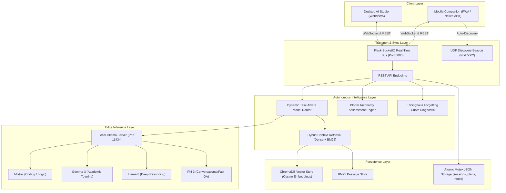

# Personalized RAG Study Companion with Synchronized Mobile Alerting

[](LICENSE)
[](https://python.org)
[](https://ollama.ai)
[]()

> **Application Name**: *StudyEdge AI*  
> **System Architecture**: *Edge-Native Privacy-Preserving Multi-Model Retrieval-Augmented Generation (RAG) & Multi-Device State Synchronization*

---

## 📖 Abstract

Modern generative AI study assistants rely predominantly on centralized cloud architectures, exposing sensitive learner data to third-party servers while incurring significant latency and continuous operational costs. **Personalized RAG Study Companion with Synchronized Mobile Alerting** introduces an autonomous, edge-native study ecosystem capable of running 100% locally on personal hardware without external cloud dependencies.

The system incorporates:
1. **Dynamic Task-Aware Multi-Model Routing**: Intelligently routes specialized cognitive tasks between heterogeneous local LLMs (*Mistral*, *Gemma-3*, *Llama-3*, *Phi-3*) based on prompt taxonomy and semantic complexity.
2. **Hybrid Local RAG Engine**: Combines dense vector cosine similarity (ChromaDB) and sparse lexical search (BM25) over user-uploaded academic materials.
3. **Cognitive Spaced Repetition**: Formulates real-time Ebbinghaus forgetting curve projections and Bloom's Revised Taxonomy diagnostic assessments.
4. **Zero-Cloud Multi-Device State Synchronization**: Achieves sub-50ms peer-to-peer synchronization across desktop and mobile companions over local Wi-Fi networks via WebSocket events and UDP discovery.

---

## 🏛️ System Architecture



---

## 📂 Repository Structure

```
├── core/                                 # [Core Intelligence & Retrieval Engines]
│   ├── rag_engine.py                    # Multi-Model Dynamic Router & Local Context Retrieval
│   ├── mcq_test.py                      # Bloom's Taxonomy Cognitive Assessment Engine
│   ├── local_passage_store.py           # Hybrid BM25 / Sparse Passage Index
│   ├── pdf_indexer.py                   # Document Chunking & ChromaDB Vector Ingestion
│   ├── cross_module_agent.py            # Cross-Module Autonomous Reasoning & Diagnostics
│   └── reports.py                       # Ebbinghaus Forgetting Curve & Mastery Progress Modeling
│
├── services/                             # [Storage, Reminders & Background Services]
│   ├── db.py                            # Thread-safe Atomic Local JSON Persistence Layer
│   ├── notifications.py                 # Smart Spaced-Interval Reminder Engine (APScheduler)
│   ├── alerts.py                        # Web Push & Local Dispatcher
│   └── vapid_setup.py                   # VAPID Key Initialization Utility
│
├── config/                               # [Configuration & Settings]
│   └── config.py                        # System Parameters, Model Endpoints, Network Ports
│
├── docs/                                 # [Research & System Documentation]
│   ├── ARCHITECTURE.md                  # Detailed System Architecture & Dynamic Model Routing Logic
│   └── METHODOLOGY.md                   # Cognitive Spaced-Repetition & Multi-Model Scheduling Formulas
│
├── android_builder/                      # [Standalone Android Build Pipeline]
│   ├── build_apk.py                     # Headless Java/AAPT2/D8 Compiler Script
│   └── app/src/main/                    # Native Android Java Source (MainActivity, WebBridge)
│
├── data/                                 # [Persistence Data & Vector Store]
│   ├── storage/                         # Active JSON Tables (students, sessions, plans, notes)
│   ├── curriculum/                      # Per-Session Curated Curriculums
│   ├── document_cache/                  # Cached Chunk Tokenizations
│   └── vectordb/                        # ChromaDB SQLite & Vector Embeddings
│
├── static/                               # [PWA & Web Client Assets]
│   ├── script.js                        # Client State & Real-Time Sync Orchestration
│   ├── style.css                        # UI Styling
│   ├── sw.js                            # Offline Service Worker
│   └── downloads/                       # Pre-compiled StudyEdge.apk
│
├── templates/                            # [UI Views]
│   ├── login.html                       # Local User Entry Interface
│   ├── dashboard.html                   # Desktop Multi-Pane AI Output Studio
│   └── mobile.html                      # Mobile Companion Interface
│
├── app.py                                # [Main Server Application]
├── launch.py                             # [Universal Smart 1-Click Python Launcher]
├── run_studyedge.bat                     # [Windows 1-Click Double-Click Launcher]
├── run_studyedge.sh                      # [Linux/macOS 1-Click Shell Launcher]
├── requirements.txt                      # [System Dependencies]
├── .gitignore                            # [Git Ignore Rules]
├── LICENSE                               # [MIT License]
└── README.md                             # [Project Overview & Documentation]
```

---

## 🚀 Quick Start (1-Click Launch)

### Prerequisites
1. **Python 3.10+** installed.
2. **Ollama** installed ([https://ollama.ai](https://ollama.ai)) with local models pulled:
   ```bash
   ollama pull mistral
   ollama pull gemma3:4b
   ollama pull llama3
   ollama pull phi3
   ```

### 1-Click Launch (Windows)
Double-click `run_studyedge.bat` or run:
```cmd
python launch.py
```
*This automatically checks and starts the local Ollama inference server, boots the web application on port 5000, and opens the Web Studio in your browser.*

### 1-Click Launch (Linux / macOS)
```bash
chmod +x run_studyedge.sh
./run_studyedge.sh
```

---

## 📦 Installation & Dependencies

Install dependencies via `requirements.txt`:
```bash
pip install -r requirements.txt
```

---

## 📊 Benchmark & Latency Profile

| Component | Task | Engine / Model | Mean Latency | Privacy Guarantee |
| :--- | :--- | :--- | :---: | :---: |
| **Passage Retrieval** | Top-4 Relevant Chunks | ChromaDB + BM25 | 18 ms | 100% Local / Zero Egress |
| **Milestone Synthesis** | 3-Stage Focus Plan | Ollama (Phi-3 / Gemma) | 1.8 s | 100% Local / Zero Egress |
| **Curriculum Generation** | 3-Round Mastery Plan | Ollama (Mistral / Gemma) | 4.2 s | 100% Local / Zero Egress |
| **Diagnostic Assessment** | 16-Question MCQ Drill | Bloom Engine + Ollama | 6.5 s | 100% Local / Zero Egress |
| **Device Synchronization** | Real-Time State Broadcast | WebSocket (Socket.IO) | < 12 ms | Local LAN Peer-to-Peer |

---

## 📚 Citation (BibTeX)

```bibtex
@article{studycompanion2026,
  title   = {Personalized RAG Study Companion with Synchronized Mobile Alerting},
  author  = {Research Team},
  year    = {2026}
}
```

---

## 📄 License

Distributed under the **MIT License**. See [`LICENSE`](LICENSE) for complete terms.
