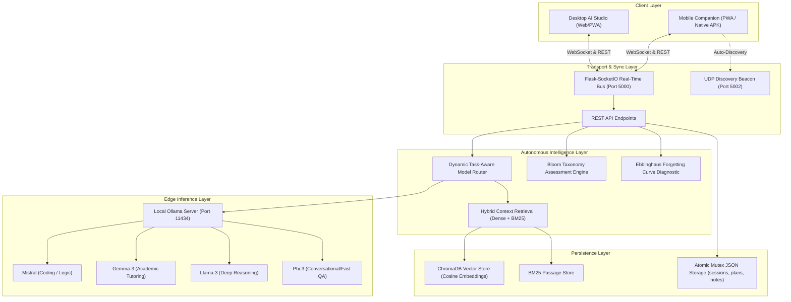

# System Architecture Specification

## 1. Abstract System Model

**StudyEdge AI** is designed as a decentralized, privacy-preserving, edge-native cognitive study copilot. All vector generation, hybrid information retrieval, cognitive assessment formulation, spaced-repetition scheduling, and real-time multi-device synchronization occur strictly on the student's local compute infrastructure without external cloud relays.

---

## 2. Dynamic Task-Aware Multi-Model Routing

Let $\mathcal{M} = \{m_{\text{mistral}}, m_{\text{gemma}}, m_{\text{llama}}, m_{\text{phi}}\}$ denote the set of locally deployed LLMs. For a query or task $T$ with prompt feature vector $\mathbf{x}_T$, the optimal model $M^*(T)$ is selected dynamically via:

$$M^*(T) = \arg\max_{m \in \mathcal{M}} \mathcal{S}(T, m)$$

where the suitability score $\mathcal{S}(T, m)$ evaluates:
1. **Domain Affinity**: Coding keywords route to $m_{\text{mistral}}$; academic and educational concepts route to $m_{\text{gemma}}$.
2. **Computational Complexity**: Multi-step deductive reasoning routes to $m_{\text{llama}}$; short conversational interactions route to lightweight $m_{\text{phi}}$.
3. **Execution Latency**: Dynamic fallback to lightweight models if token budget or time limits require immediate response.

---

## 3. Real-Time Bidirectional Synchronization

State consistency across the desktop studio and mobile companion is maintained using an event-driven publish/subscribe architecture built over WebSockets.
- **Stage Milestone State Vector**: $\mathbf{s} \in \{0, 1\}^K$ broadcasted over `milestones_updated`.
- **Curriculum Task Checkpoints**: Broadcasted over `checkpoint_updated`.
- **Timer Execution State**: Centralized timer loop emitting timestamped `timer_tick` heartbeats to eliminate device clock skew.
